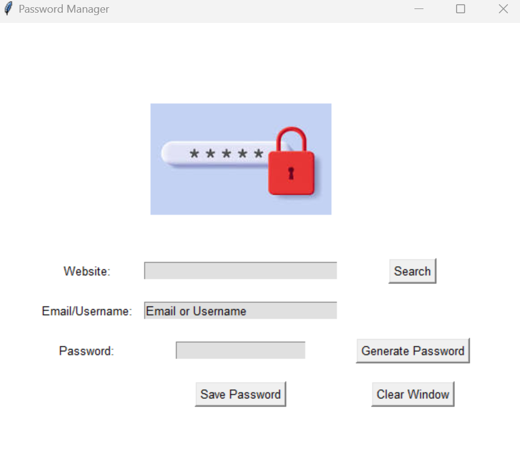

# Password Generator App



## Table of Contents

- [Description](#description)
- [Features](#features)
- [Installation](#installation)
- [Usage](#usage)
- [Author](#author)

## Description
This is a simple password manager application built using the Python `tkinter` library. The application allows you to 
generate and save passwords for various websites along with your email or username.
## Features

- Password Generation: The application includes a password generator feature that can create strong, random passwords 
for you. The generated passwords include a combination of uppercase and lowercase letters, numbers, and symbols.
- Password Storage: You can save the details of websites, email addresses, and passwords. The saved data is 
- stored in a json file named `password.json`.
- User Interface : The application provides an intuitive user interface where you can input website name, 
username, email address, clear, and view or generate passwords.
- Credentials recovery: The application provides a search button for any website credentials previously saved.

## Installation
1. Clone the repository:
   ```bash
   git clone https://github.com/laurianerzb/password-generator.git
2. Navigate to the project directory:
   ```bash 
   cd password-generator
3. Make sure you have Python installed. This application was built using Python 3.9

## Usage

1. Fill in the necessary details for the website, email, and password. 
2. You can use the "Generate Password" button to create a strong password.
3. Click the "Save Password" button to save the entered information. A popup will confirm 
the saving of the password.
4. The saved data will be stored in the password.json file ,and they can be retrieved using the search button
5. 

## Author
- [laurianerzb](https://github.com/laurianerzb)
